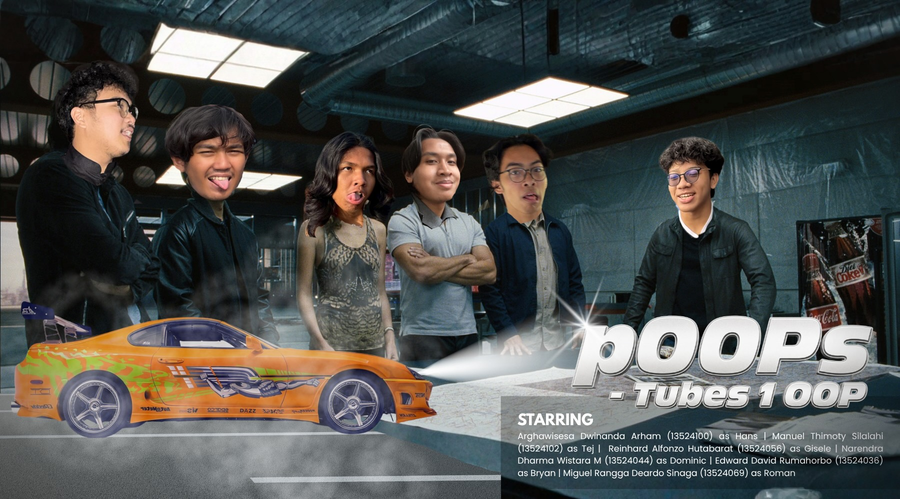

# Nimonspoli - Tugas Besar IF2010 Pemrograman Berorientasi Objek

## 📖 Deskripsi Proyek
**Nimonspoli** adalah permainan papan (*board game*) berbasis giliran yang mengadaptasi mekanisme klasik Monopoli dengan penambahan elemen strategis berupa **Skill Cards** dan fitur **Papan Dinamis**. Proyek ini dikembangkan menggunakan bahasa C++ dengan mengedepankan prinsip-prinsip Pemrograman Berorientasi Objek (OOP) dan arsitektur berlapis (*Layered Architecture*).

## 👥 Anggota Kelompok (POOPS - POP)
Proyek ini dikerjakan oleh Kelompok **POOPS (Kode: POP)**:
1. **13524036** - Edward David Rumahorbo
2. **13524044** - Narendra Dharma Wistara Marpaung
3. **13524056** - Reinhard Alfonzo Hutabarat
4. **13524069** - Miguel Rangga Deardo Sinaga
5. **13524100** - Arghawisesa Dwinanda Arham
6. **13524102** - Manuel Thimoty Silalahi

## 🏗️ Arsitektur dan Struktur Proyek
Sistem dibagi menjadi tiga lapisan utama untuk menjaga pemisahan tanggung jawab (*Separation of Concerns*):

* **User Interaction (UI) Layer**: Berada di folder `include/views` dan `src/views`, menangani representasi visual menggunakan GUI.
* **Game Logic (Core) Layer**: Berada di folder `include/core`, `include/models`, `src/core`, dan `src/models`. Menangani aturan permainan, status pemain, dan logika papan.
* **Data Access Layer (DAL)**: Diimplementasikan melalui `ConfigLoader` dan `SaveLoadManager` untuk menangani persistensi data dan pembacaan konfigurasi eksternal.

### Folder Utama:
* `include/`: Berisi seluruh *header file* (`.hpp`).
* `src/`: Berisi implementasi logika program (`.cpp`).
* `config/`: Berisi file konfigurasi permainan (`.txt`) seperti properti, pajak, dan petak spesial.
* `assets/`: Berisi aset visual untuk GUI (gambar dadu, pion, tombol).

## 🛠️ Persyaratan Sistem
* **C++ Compiler**: Mendukung standar C++11 atau lebih tinggi.
* **CMake**: Minimal versi 3.10.

## 🚀 Cara Kompilasi dan Menjalankan
Proyek menggunakan CMake sebagai sistem build lintas platform. Gunakan perintah berikut di terminal:

1.  **Konfigurasi Proyek**:
    ```bash
    cmake -S . -B build
    ```
2.  **Kompilasi**:
    ```bash
    cmake --build build
    ```
3.  **Menjalankan Program**:
    ```bash
    ./build/game
    ```
4.  **Membersihkan Hasil Build (Opsional)**

    Linux dan macOS:
    ```bash
    rm -rf build
    ```
    Windows:
    ```bash
    Remove-Item -Recurse -Force build
    ```

## 🎮 Fitur Utama
* **Papan Dinamis**: Ukuran dan tata letak papan dapat dikonfigurasi melalui file teks eksternal.
* **Sistem Properti Variatif**: Mencakup *Street*, *Railroad*, dan *Utility* dengan aturan sewa yang berbeda.
* **Skill Cards**: Mekanisme kartu unik yang memberikan keuntungan strategis (Teleport, Lasso, Demolition, dll.).
* **Mekanisme Lelang**: Proses penawaran kompetitif untuk properti yang tidak dibeli langsung oleh pemain.
* **Manajemen Status**: Penanganan kondisi kompleks seperti penjara, gadai properti, dan kebangkrutan.

## 📑 Detail Teknis (Pilar OOP)
Rancangan ini mengimplementasikan pilar utama OOP secara mendalam:
* **Encapsulation**: Penyembunyian data melalui akses *private* dan pemanfaatan *Singleton Pattern* untuk manajer pusat.
* **Inheritance**: Hierarki kelas yang kuat pada komponen `Tile` (petak) dan `SkillCard`.
* **Polymorphism**: Penggunaan fungsi virtual untuk eksekusi efek petak (`onLanded`) dan penggunaan kartu (`useSkill`).
* **Abstraction**: Penggunaan kelas abstrak sebagai cetak biru untuk elemen-elemen permainan.
